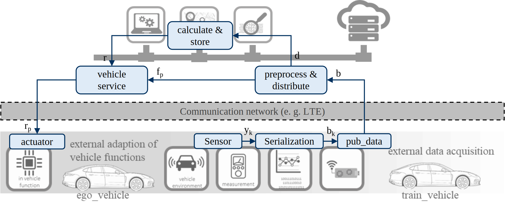
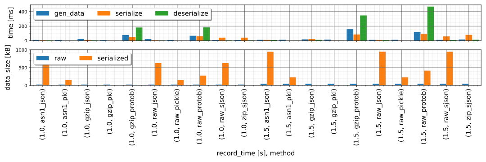
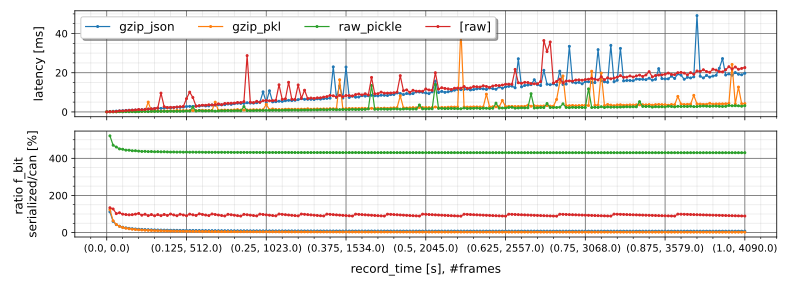
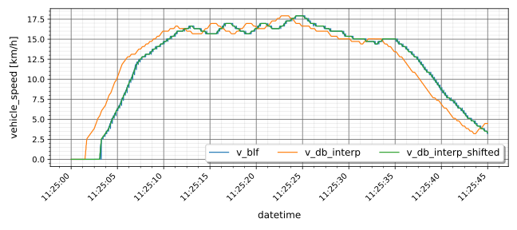

# Framework evaluation for backend based functions in the context of connected vehicles


jupyter-notebooks with python-code and results  
created in the context of a publication at the 9th AutoTest Conference, 
19./20.10.2022, FKFS, Stuttgart

**Features**:
- 


---

author: *Tim Häberlein*

Technische Universität Dresden  
Fakultät Verkehrswissenschaften „Friedrich List“  
Institut für Automobiltechnik Dresden (IAD)  
Professur für Fahrzeugmechatronik  
George-Bähr-Str. 1b  
01062 Dresden

---


## table of contents

1. [Introduction](#introduction)
1. [Data Serialization](#data-serialization)
1. [Data Validation](#data-validation)
1. [Setup/Installation Notes](#setupinstallation-notes)
   1. [Install Python](#python-installation)
   2. [Create Virtual Environment](#create-venv)
   3. [Install Requirements](#install-required-python-packages)

## Introduction
The following research was done in the context of a publication at the Autotest 2022 in Stuttgart. 
The paper deals with the analysis of a v2c2v-framework 
for the implementation of backend-based functions.

The basic structure of the framework is the following:


In order to evaluate such a framework, it is important to know the delays in the system 
as well as to ensure a valid data transmission.

## Data Serialization
As mentioned before the data load and latency of the serialization 
is a relevant analysis part for a v2c2v-framework.
Therefore, different methods are implemented and tested against each other.
Following methods are examined:
- integrated (json, pickle)
- superjson (with compress and not)
- protobuf
- gzip (with json, pickle, protobuf)
- asn1 (with json, pickle)

The relevant data load is calculated 
in the jupyter-notebook [can_test](serialization/can_test.ipynb).
As a result, a maximum of 4090 frames per second are transmitted.

Based on this fact, the following comparison is possible:


In detail only the following compared methods are possible:


All calculation can be found here in the jupyter-notebook [data_serialization](data_serialization.ipynb)

The conclusion is shown in the paper.


## Data Validation
Within the context of the studies, 
the functionality of the framework should be verified.  
For this purpose, measurement data collected locally in the vehicle 
using conventional measurement tools and 
data collected using the framework were compared.

The direct comparison of the example data is shown in the following figure:


After a time shift of approx. 1,56 seconds, the data looks like:


In summary, the validation shows that the framework can capture data validly.

In the jupyter-notebook [data_validation](data_validation.ipynb) 
the comparison is shown.
For more details are shown in the following jupyter notebooks:
- [time shift](data_validation/time_shift.ipynb): studies on the time offset of the two measurement methods 
- [time shift test](data_validation/time_shift_test.ipynb): basics of the time offset calculation
- [read data](data_validation/read_data_example.ipynb): basics of the data work

## Setup/Installation Notes

### Python Installation

1. If you haven't installed python you can find
   [Python 3.10.2](https://www.python.org/ftp/python/3.10.2/python-3.10.2-amd64.exe)
   here.  
   Or choose your own version from [official web-site](https://www.python.org/).  
   Other python-distribution may be work with this repro too!

1. You can use the included [setup.bat](setup.bat)
   to **skip** the following installation steps.

---

### Create VENV

*If you want to run your installation in a virtual environment, create one. If not - skip this step.*

1. Create an environment (e.g. "venv")

    ```cmd
    python -m venv venv_cocapl
    ```
2. Now activate the environment (Windows):
    ```cmd
    venv_cocapl\Scripts\activate.bat
    ```
3. For more informations click [here](https://docs.python.org/3/tutorial/venv.html)
---

### Install Required python-packages

**Use requirements.txt to install all required packages**

```cmd
pip install -r requirements.txt
```
